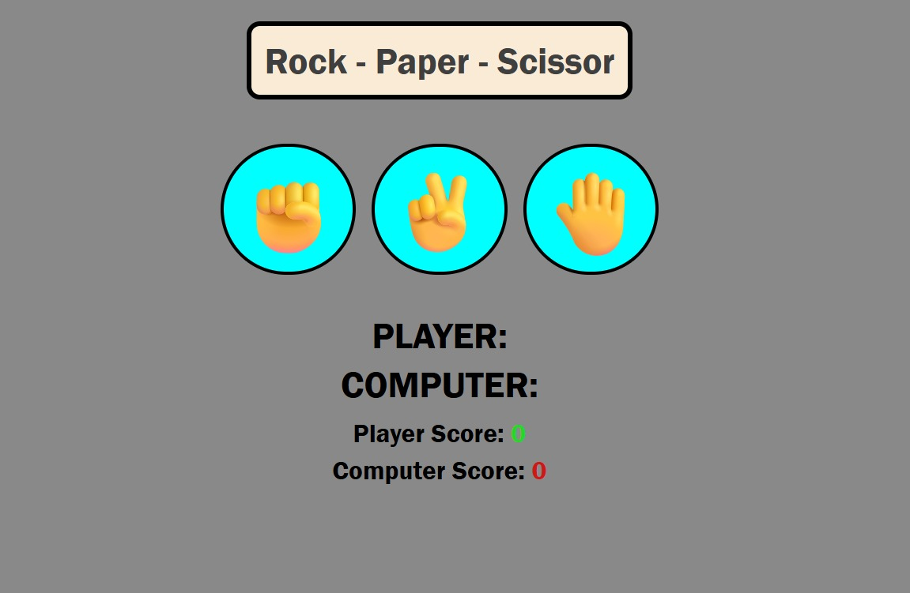

<h1 align="center">✊ Rock - Paper - Scissors ✋</h1>

<p align="center">
  <b>Play the classic Rock Paper Scissors game right in your browser!</b><br>
  Built with ❤️ using <code>HTML</code>, <code>CSS</code>, and <code>JavaScript</code>.
</p>

---

## 🎮 Live Demo
> 🔗 [Click here to play the game]([https://your-demo-link.com](https://rock2scissorspaper.netlify.app/))  
*(replace this link with your GitHub Pages / Netlify link)*

---

## 🧩 How to Play

1. Choose your move: ✊ **Rock**, ✋ **Paper**, or ✌️ **Scissors**  
2. The computer picks one too.  
3. Results appear instantly:
   - ✊ beats ✌️ → **Rock crushes Scissors**
   - ✋ beats ✊ → **Paper covers Rock**
   - ✌️ beats ✋ → **Scissors cut Paper**
4. Keep playing — the game tracks your **score**!

---

## ⚙️ Tech Stack
| Tech | Use |
|------|-----|
| 🧱 **HTML5** | Game structure |
| 🎨 **CSS3** | Styling and animations |
| ⚡ **JavaScript (ES6)** | Game logic & interactivity |

---

## 🕹️ Gameplay Preview
<p align="center">
  
</p>

---

## 💻 Installation & Setup

```bash
# Clone the repo
git clone https://github.com/yourusername/rock-paper-scissors.git

# Open the folder
cd rock-paper-scissors

# Run locally
# Just open index.html in your browser
